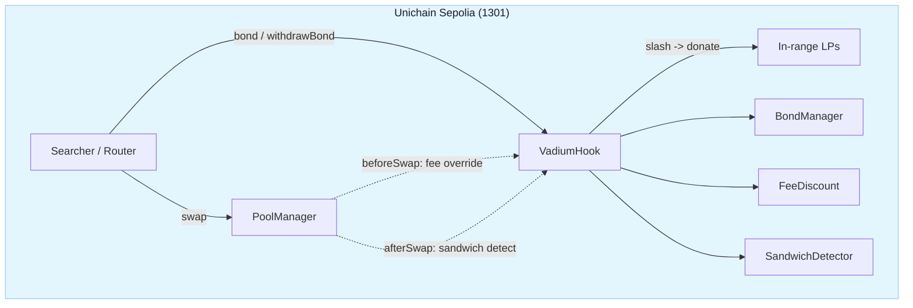

# Vadium

[](https://soliditylang.org)
[](https://book.getfoundry.sh)
[](LICENSE)
[](https://github.com/Majormaxx/vadium/actions)
[](https://sepolia.uniscan.xyz)

A Uniswap v4 hook that prices sandwich protection into the fee. Searchers post a bond in the pool's fee token to qualify for a swap-fee discount; a searcher whose own on-chain activity matches a same-block sandwich pattern gets slashed, and the confiscated capital goes straight to in-range LPs via `donate()`. No oracle, no swap, no off-chain watcher.

This is a hackathon build for the UHI10 Hookathon. Testnet only, unaudited.

## Problem

Sandwich attacks extract value by front-running a victim's swap, then back-running to realize the price move. The searcher who sandwiches is easy to identify after the fact by pattern, but v4 hooks are stateless between blocks and can't afford to Q-bird every tx. The standard answer, a fee rebate for honest searchers, has no teeth: nothing stops an attacker from claiming the rebate and attacking anyway.

## The design

Two mechanisms pull against each other, and that tension is the point.

**Fee discount (the carrot).** A searcher who `bond()`s `token1` gets a `beforeSwap` fee override that cuts the pool's 30 bps fee on their swaps. The discount only attaches if the searcher keeps trading from the same bonded address.

**Slash (the stick).** Reusing that same address across a sandwich is exactly what a sandwich looks like to this hook. The `afterSwap` detector checks each swap against the searcher's prior swap in the same block: same address, same block, reversed direction, an intervening swap from a different address. A match confiscates half the bond on first offense, escalates to a full slash plus a re-bonding ban on repeat, and routes the capital to in-range LPs.

The bond is the load-bearing piece. A searcher only realizes the discount by keeping one bonded identity, but keeping one identity across a sandwich is precisely what trips detection. Bad actors can dodge it by spreading across fresh addresses, which is a disclosed v1 weakness, not a hidden one (see Adversarial analysis).

## Architecture



## System lifecycle

| Step | Trigger | Actor |
|---|---|---|
| 1. Bond | `bond(amount)` with token1 | Searcher |
| 2. Discounted swap | `beforeSwap` applies fee override | PoolManager |
| 3. Record swap | `afterSwap` stores sender leg | Hook |
| 4. Match detection | same block, same address, reversed direction, intervening other address | Hook |
| 5. First offense | slash 50% of bond, extend lock window | Hook |
| 6. Repeat offense | full slash + ban from re-bonding | Hook |
| 7. Donate | slashed token1 to in-range LPs via `donate()` | Hook |
| 8. Withdraw | `withdrawBond()` after minimum duration | Searcher |

## Deployments

Nothing is deployed yet; addresses are filled after the testnet broadcast.

| Contract | Chain | Address |
|---|---|---|
| `VadiumHook` | Unichain Sepolia (1301) | pending |
| Vadium pool | Unichain Sepolia (1301) | pending |

## Contract

### Permission bits

The hook address is CREATE2-mined so its lower 14 bits encode the required flags (`mask 0x00C0`). The deploy script brute-forces the salt against the deterministic factory.

| Callback | Purpose |
|---|---|
| `beforeSwap` | Apply bonded fee discount via `OVERRIDE_FEE_FLAG` |
| `afterSwap` | Record swap leg, run sandwich detection, slash + donate |

Detection and slashing run only inside the `afterSwap` callback, so they sit under v4's callback reentrancy lock. Bond transfers use `SafeERC20`. Callback entrypoints are gated by `onlyPoolManager`.

### Bond mechanics

| Parameter | Default | Notes |
|---|---|---|
| `DEFAULT_FEE_DISCOUNT_BPS` | 10 | 0.10% off the pool fee |
| `DEFAULT_MIN_BOND` | 100e6 | 100 USDC |
| `DEFAULT_MIN_BOND_DURATION_BLOCKS` | 100 | lock before withdrawal |
| `FIRST_SLASH_BPS` | 5000 | 50% on first offense |
| `FIRST_OFFENSE_LOCK_EXTENSION_BLOCKS` | 7,200 | window for escalation |
| `REPEAT_OFFENSE_BAN_BLOCKS` | 216,000 | re-bond ban on repeat |

### Interface

```solidity
interface IVadiumHook {
    function bond(uint256 amount) external;
    function withdrawBond() external;

    function isBonded(address searcher) external view returns (bool);
    function bondedBalance(address searcher) external view returns (uint256);
    function isBanned(address searcher) external view returns (bool);
}
```

## Detection

The detector keys on four conditions inside one block, all observable from the hook's own callback state:

1. The sender has a prior swap in this block.
2. The prior swap was in the opposite direction.
3. A different address swapped between the two legs.
4. No cross-block or cross-pool sequencing is considered.

Position-in-block is a monotonic per-block counter, so a later swap always has a strictly larger `positionInBlock`. The intervening-swap signal comes from the immediately-preceding swapper: if it differs from the current sender, a different address swapped after the sender's prior leg.

The two-tier slash is calibrated against false positives. A same-block direction reversal is a strong signal but not proof beyond doubt (a market maker rebalancing can trip it), so a first flag takes only a portion, and only a repeat inside the extended lock window draws the full slash and the ban.

```solidity
uint256 slashed = b.computeSlash(isRepeat, FIRST_SLASH_BPS);
// first offense: (amount * 5000) / 10_000
// repeat:         full remaining amount
```

## Gas (testnet, unoptimized)

| Operation | Gas |
|---|---|
| `bond` | 124,370 |
| `withdrawBond` | 148,432 |
| Non-sandwich swap through hook | 437,982 |
| Sandwich -> slash + donate | 711,531 |

Hook runtime bytecode ~5.6 kB, creation ~6.2 kB. These are the per-operation gas deltas measured in `Integration.t.sol`; the constant per-swap detection bookkeeping in `afterSwap` is paid by every swapper on the pool, bonded or not.

## Events

| Event | Indexed | Consumer |
|---|---|---|
| `Bonded(address,uint256,uint256)` | searcher | Off-chain |
| `BondWithdrawn(address,uint256)` | searcher | Off-chain |
| `Sandwiched(address,uint256,bool,uint256,uint256)` | searcher | Off-chain |

## Custom errors

| Error | Parameters | Reverts when... |
|---|---|---|
| `BondTooSmall` | `uint256 amount, uint256 minimum` | Bond below `DEFAULT_MIN_BOND` |
| `BondNotMatured` | `uint256 currentBlock, uint256 maturityBlock` | Withdraw before lock elapses |
| `Banned` | `uint256 bannedUntil` | Banned address bonds or withdraws |
| `NoBond` | -- | Withdraw with no live bond |
| `BondAlreadyActive` | -- | Re-bond while one is active |
| `UnsupportedOperation` | -- | `unlock()` callback reached |

## Access control

| Surface | Role | Functions |
|---|---|---|
| Bond lifecycle | Anyone | `bond`, `withdrawBond` |
| Swap callbacks | `PoolManager` only | `beforeSwap`, `afterSwap` (`onlyPoolManager`) |

There is no wallet-admin role. Bonding is permissionless; callback entrypoints are locked to the PoolManager by `SafeCallback`. The deployer's only leverage is the CREATE2 salt that places the hook.

## Deploy

Unichain Sepolia, chain ID 1301:

```
forge script app/script/Deploy.s.sol:DeployVadium \
  --rpc-url "$UNICHAIN_SEPOLIA_RPC" \
  --broadcast -vvvv
```

The script guards `block.chainid == 1301`, mines the CREATE2 salt, deploys via the deterministic factory, and initializes the pool at tick 0.

| Address | Value |
|---|---|
| PoolManager (Sepolia 1301) | `0x00B036B58a818B1BC34d502D3fE730Db729e62AC` |
| USDC | `0x31d0220469e10c4E71834a79b1f276d740d3768F` |
| Deterministic deployer | `0x4e59b44847b379578588920cA78FbF26c0B4956C` |

Pool: native ETH (`token0`) / USDC (`token1`), static 30 bps fee, tick spacing 10.

## Structure

```
src/core/
├── VadiumHook.sol                # The hook
├── interfaces/IVadiumHook.sol    # Searcher-facing bond surface
└── libraries/
    ├── BondManager.sol           # Two-tier slash + expiry math
    ├── FeeDiscount.sol           # Before-swap fee override rules
    └── SandwichDetector.sol      # Same-block sandwich match logic
app/script/Deploy.s.sol           # CREATE2 salt mining + pool init
test/                             # 72 tests (unit + integration + gas)
```

## Test

```
forge test
```

72 tests across 5 suites, all green under the `fast` profile, `forge fmt --check` clean.

| Suite | Area |
|---|---|
| `VadiumHook.t.sol` | Bond lifecycle, slash escalation, bans |
| `BondManager.t.sol` | Slash math, expiry windows |
| `FeeDiscount.t.sol` | Override rules, boundaries |
| `SandwichDetector.t.sol` | Pattern matching |
| `Integration.t.sol` | Per-user-router end-to-end + gas benchmarks |

The integration tests run against a real `PoolManager` with per-user `SwapRouter` instances, because in v4 the `sender` the hook sees in `afterSwap` is the router, not the EOA. Each actor gets its own router, and the router is the bonded identity.

## Adversarial analysis

This is the buildable subset of a sandwich, not a full sandwich detector. Disclosed v1 weaknesses:

- Detection keys on address reuse. A searcher running two fresh wallets or a mule address across the sandwich legs is not matched. v2 countermeasure: a cross-address link prover or ordering analysis.
- Detection is scoped to same-block, same-pool activity. Cross-pool, multi-block sequencing is out of scope.
- The per-swap detection bookkeeping in `afterSwap` costs gas for every swapper, bonded or not, since it runs on the hot path.

Nothing here substitutes for an audit.

## License

MIT.
