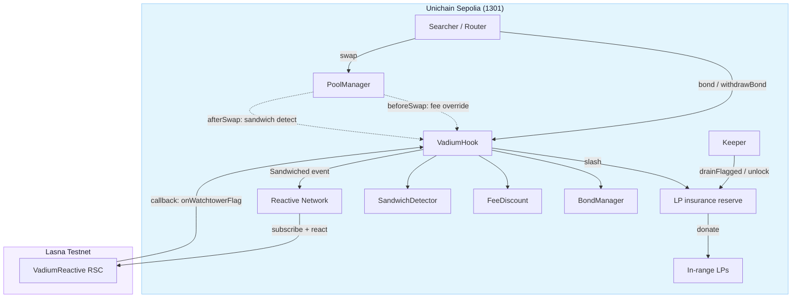

# Vadium

[](https://soliditylang.org)
[](https://book.getfoundry.sh)
[](LICENSE)
[](https://github.com/Majormaxx/vadium/actions)
[](https://sepolia.uniscan.xyz)

A Uniswap v4 hook that makes sandwich attacks unprofitable instead of just detected. The cost of attacking is staked upfront: a searcher posts a bond in the pool's fee token to earn a lower swap fee, and when their own flow reads as a sandwich, that bond is slashed and held in an LP insurance reserve. No oracle, no swap, no off-chain watcher to run the core pool.

This is a hackathon build for the UHI10 Hookathon. Testnet only, unaudited.

## Problem

When you swap tokens, someone else can watch your order, buy just before you, move the price, then sell back to you at the worse price. They profit, you pay more. That is a sandwich attack, and it hits ordinary users hardest because they never see it coming.

Standard answers either raise fees to deter attackers (which punishes honest traders too) or rebate honest searchers (which attackers can just claim). Neither makes low-fee, volatile-pair liquidity safe to provide.

## The design

Think of it as a rental-car security deposit.

A trader who wants lower fees on this pool puts down a deposit in the pool's own token. As long as they trade honestly, they keep the deposit and pay a reduced fee. If they are caught sandwiching, part of their deposit is taken. The money taken goes into a reserve that pays the pool's liquidity providers.

The load-bearing piece is the tension between the two sides:

**Fee discount (the carrot).** A searcher who `bond()`s `token1` gets a `beforeSwap` fee override that cuts the pool's 30 bps fee on their swaps. The discount only holds if the searcher keeps trading from the same bonded address.

**Slash (the stick).** Reusing that same address across a sandwich is exactly what a sandwich looks like to this hook. The `afterSwap` detector checks each swap against the searcher's prior swap in the same block: same address, same block, reversed direction, an intervening swap from a different address. A match confiscates half the bond on first offense, escalates to a full slash plus a re-bonding ban on repeat, and the confiscated capital lands in the LP insurance reserve.

The mechanism does not depend on catching every attacker. To get the discount, a searcher must trade from one visible identity, and trading from one visible identity is how a sandwich gets caught. An attacker who rotates through fresh addresses avoids detection, but forgoes the discount that made bonding worthwhile. Every evasion costs more than the attack earns.

## Architecture



## System lifecycle

| Step | Trigger | Actor |
|---|---|---|
| 1. Bond | `bond(amount)` with token1 | Searcher |
| 2. Discounted swap | `beforeSwap` applies fee override | PoolManager |
| 3. Record swap | `afterSwap` stores sender leg | Hook |
| 4. Match detection | same block, same address, reversed direction, intervening other address | Hook |
| 5. First offense | slash 50% of bond, extend lock window | Hook |
| 6. Repeat offense | full slash + ban from re-bonding | Hook |
| 7. Reserve | slashed token1 credited to the LP insurance reserve | Hook |
| 8. Claim | owner/keeper routes reserve to in-range LPs via `donate()` | Hook |
| 9. Withdraw | `withdrawBond()` after minimum duration | Searcher |

## Deployments

Nothing is deployed yet; addresses are filled after the testnet broadcast.

| Contract | Chain | Address |
|---|---|---|
| `VadiumHook` | Unichain Sepolia (1301) | pending |
| Vadium pool | Unichain Sepolia (1301) | pending |
| `VadiumReactive` RSC | Lasna testnet (5318007) | pending |

## Reactive watchtower sidecar

A full-featured Reactive Smart Contract (`src/reactive/VadiumReactive.sol`) turns the hook into a cross-chain watcher with a real, non-stubbed pipeline. When the hook slashes a searcher on Unichain Sepolia, it emits a `Sandwiched` log. The Reactive Network watches that log:

1. The RSC holds a subscription to the hook's `Sandwiched` event on the origin chain.
2. On a matched block the ReactVM calls `react()`, which dedups by origin tx hash, decodes the searcher and ban window, and emits a `Callback` back to the hook.
3. The Reactive Network injects the ReactVM ID as the callback's first argument (the placeholder the RSC emits as `address(0)`).
4. The hook's `onlyCallbackProxy` entrypoint verifies the RVM ID matches its bound watchtower and applies the flag.

The callback path is the same one the local watchtower uses: `onWatchtowerFlag` sets a live flag that strips the searcher's fee discount and records a strike under the same two-tier rules, keeping the reserve and ban bookkeeping on-chain and auditable.

The deploy uses two separate addresses for the subscription source (`originContract`) and the callback destination (`callbackTarget`); in production both are the hook. The split exists so tests can point the subscription at a fixture emitter while the callback still lands on the real hook.

## Contract

### Permission bits

The hook address is CREATE2-mined so its lower 14 bits encode the required flags (`mask 0x00C0`). The deploy script brute-forces the salt against the deterministic factory.

| Callback | Purpose |
|---|---|
| `beforeSwap` | Apply bonded fee discount via `OVERRIDE_FEE_FLAG` |
| `afterSwap` | Record swap leg, run sandwich detection, slash + credit reserve |

Detection and slashing run only inside the `afterSwap` callback, so they sit under v4's callback reentrancy lock. Bond transfers use `SafeERC20`. Callback entrypoints are gated by `onlyPoolManager`.

### Bond mechanics

| Parameter | Default | Notes |
|---|---|---|
| `DEFAULT_FEE_DISCOUNT_BPS` | 10 | 0.10% off the pool fee |
| `DEFAULT_MIN_BOND` | 100e6 | 100 USDC |
| `DEFAULT_MIN_BOND_DURATION_BLOCKS` | 100 | lock before withdrawal |
| `FIRST_SLASH_BPS` | 5000 | 50% on first offense |
| `FIRST_OFFENSE_LOCK_EXTENSION_BLOCKS` | 7,200 | window for escalation |
| `REPEAT_OFFENSE_BAN_BLOCKS` | 216,000 | re-bond ban on repeat |

### Interface

```solidity
interface IVadiumHook {
    function bond(uint256 amount) external;
    function withdrawBond() external;

    function isBonded(address searcher) external view returns (bool);
    function bondedBalance(address searcher) external view returns (uint256);
    function isBanned(address searcher) external view returns (bool);

    function insuranceReserve() external view returns (uint256);
    function remainingCoverage() external view returns (uint256);
    function slashedPledged() external view returns (uint256);
    function totalWithdrawn() external view returns (uint256);
}
```

## Insurance reserve

Slashed token1 is not handed to LPs per sandwich. It accumulates in a pooled reserve, and an authorized actor pushes it out in discrete settlements through a single PoolManager `unlock`. Pooling the slashes and releasing them on demand is what makes an off-chain watchtower usable: the observer flags an address, and the payout is one atomic settle.

| Function | Role | Effect |
|---|---|---|
| `flagFromWatchtower(searcher, amount, banUntil)` | watchtower | Record a flag; slash up to `amount` from a live bond into the reserve, counting a strike under the same two-tier rules as the on-pool detector |
| `drainFlagged(searchers)` | keeper | Push the full reserve to in-range LPs via one `unlock`, only while every listed searcher holds an active (unexpired) flag |
| `claimCoverage(amount)` | owner | Push a specific amount of reserve to in-range LPs |

The reserve invariants are `slashedPledged >= withdrawn` (you can only pay out what was slashed) and `remainingCoverage == reserve` (live coverage available). The `_slash` callback credits the reserve without touching the pool, keeping slash cost off the swap hot path.

A live watchtower flag also strips the bonded fee discount for its duration, so an evader does not keep getting cheaper swaps while under observation. And because a first offense extends the withdrawal lock to the full escalated window, a struck searcher cannot instantly re-discharge the residual bond and walk away.

## Detection

The detector keys on four conditions inside one block, all observable from the hook's own callback state:

1. The sender has a prior swap in this block.
2. The prior swap was in the opposite direction.
3. A different address swapped between the two legs.
4. No cross-block or cross-pool sequencing is considered.

Position-in-block is a monotonic per-block counter, so a later swap always has a strictly larger `positionInBlock`. The intervening-swap signal comes from the immediately-preceding swapper: if it differs from the current sender, a different address swapped after the sender's prior leg.

The two-tier slash is calibrated against false positives. A same-block direction reversal is a strong signal but not proof beyond doubt (a market maker rebalancing can trip it), so a first flag takes only a portion, and only a repeat inside the extended lock window draws the full slash and the ban.

```solidity
uint256 slashed = b.computeSlash(isRepeat, FIRST_SLASH_BPS);
// first offense: (amount * 5000) / 10_000
// repeat:         full remaining amount
```

## Gas (testnet, unoptimized)

| Operation | Gas |
|---|---|
| `bond` | 124,246 |
| `withdrawBond` | 148,326 |
| Non-sandwich swap through hook | 420,683 |
| Sandwich -> slash + credit reserve | 714,467 |

Hook runtime bytecode ~5.6 kB, creation ~6.2 kB. These are the per-operation gas deltas measured in `Integration.t.sol`; the constant per-swap detection bookkeeping in `afterSwap` is paid by every swapper on the pool, bonded or not.

## Events

| Event | Indexed | Consumer |
|---|---|---|
| `Bonded(address,uint256,uint256)` | searcher | Off-chain |
| `BondWithdrawn(address,uint256)` | searcher | Off-chain |
| `Sandwiched(address,uint256,bool,uint256,uint256)` | searcher | Off-chain |
| `WatchtowerSet(address)` | watchtower | Audit |
| `KeeperSet(address)` | keeper | Audit |
| `Flagged(address,uint256,uint256)` | searcher | Watchtower UI |
| `CoverageClaimed(uint256,uint256)` | -- | Off-chain |
| `Callback(...)` (RSC) | -- | Reactive Network |

## Custom errors

| Error | Parameters | Reverts when... |
|---|---|---|
| `BondTooSmall` | `uint256 amount, uint256 minimum` | Bond below `DEFAULT_MIN_BOND` |
| `BondNotMatured` | `uint256 currentBlock, uint256 maturityBlock` | Withdraw before lock elapses |
| `Banned` | `uint256 bannedUntil` | Banned address bonds or withdraws |
| `NoBond` | -- | Withdraw with no live bond |
| `BondAlreadyActive` | -- | Re-bond while one is active |
| `Unauthorized` | -- | Role-gated call from the wrong address |
| `AlreadySet` | -- | Set a watchtower or keeper a second time, or before drain |
| `NotFlagged` | -- | Drain lists no, or an un-flagged, address |
| `PayoutExceedsReserve` | `uint256 amount, uint256 reserve` | Claim exceeds live coverage |

## Access control

| Surface | Role | Functions |
|---|---|---|
| Bond lifecycle | Anyone | `bond`, `withdrawBond` |
| Swap callbacks | `PoolManager` only | `beforeSwap`, `afterSwap` (`onlyPoolManager`) |
| Roles | owner | `setWatchtower`, `setKeeper`, `claimCoverage` |
| Watchtower | one address | `flagFromWatchtower` |
| Callback proxy | Reactive callback proxy | `onWatchtowerFlag` (`onlyCallbackProxy`) |
| Keeper | one address | `drainFlagged` |

The owner is the deployer (or the seed of `initializeOwner` when the hook is placed at its permission address without a constructor run). Watchtower and keeper are assigned once each. Bonding is permissionless; callback entrypoints are locked to the PoolManager by `SafeCallback`. The Reactive entrypoint `onWatchtowerFlag` is locked to the configured callback proxy by `onlyCallbackProxy` and verifies that the injected ReactVM ID matches the bound watchtower.

## Deploy

Unichain Sepolia, chain ID 1301:

```
forge script app/script/Deploy.s.sol:DeployVadium \
  --rpc-url "$UNICHAIN_SEPOLIA_RPC" \
  --broadcast -vvvv
```

The script guards `block.chainid == 1301`, mines the CREATE2 salt, deploys via the deterministic factory, and initializes the pool at tick 0.

| Address | Value |
|---|---|
| PoolManager (Sepolia 1301) | `0x00B036B58a818B1BC34d502D3fE730Db729e62AC` |
| USDC | `0x31d0220469e10c4E71834a79b1f276d740d3768F` |
| Deterministic deployer | `0x4e59b44847b379578588920cA78FbF26c0B4956C` |

Pool: native ETH (`token0`) / USDC (`token1`), static 30 bps fee, tick spacing 10.

The Reactive sidecar deploys separately to the Lasna testnet (chain ID 5318007):

```
forge script app/script/DeployReactive.s.sol:DeployVadiumReactive \
  --rpc-url "$REACTIVE_LASNA_RPC" \
  --broadcast -vvvv
```

The RSC takes the origin chain ID, the hook address (used for both the subscription source and the callback target), a callback gas limit, and the deployer as owner. After both deploys land, the hook owner binds the RSC's address as the watchtower with `setWatchtower`, so callbacks from the ReactVM are accepted and applied.

## Structure

```
src/core/
├── VadiumHook.sol                # The hook
├── interfaces/IVadiumHook.sol    # Searcher-facing bond surface
└── libraries/
    ├── BondManager.sol           # Two-tier slash + expiry math
    ├── FeeDiscount.sol           # Before-swap fee override rules
    ├── InsurancePolicy.sol       # LP insurance reserve accounting
    └── SandwichDetector.sol      # Same-block sandwich match logic
src/reactive/
└── VadiumReactive.sol            # Cross-chain watchtower RSC (Reactive Network)
app/script/Deploy.s.sol           # CREATE2 salt mining + pool init
app/script/DeployReactive.s.sol   # Lasna RSC deploy
test/                             # 121 tests (unit + integration + reactive + gas)
```

## Test

```
forge test
```

121 tests across 6 suites, all green under the `fast` profile, `forge fmt --check` clean.

| Suite | Area |
|---|---|
| `VadiumHook.t.sol` | Bond lifecycle, slash escalation, bans, reserve, roles, watchtower flag entrypoint |
| `React.t.sol` | Reactive sidecar end-to-end: subscription, reaction, cross-chain callback injection, dedup |
| `BondManager.t.sol` | Slash math, expiry windows |
| `FeeDiscount.t.sol` | Override rules, boundaries |
| `SandwichDetector.t.sol` | Pattern matching |
| `Integration.t.sol` | Per-user-router end-to-end, real reserve drain, gas benchmarks |

The integration tests run against a real `PoolManager` with per-user `SwapRouter` instances, because in v4 the `sender` the hook sees in `afterSwap` is the router, not the EOA. Each actor gets its own router, and the router is the bonded identity.

## Adversarial analysis

Detection alone cannot catch everyone, so the design does not rely on it. Three layers, in the order they matter:

1. **On-pool detector.** Catches the obvious case instantly: same account, same block, reversing the trade. Runs in `afterSwap` on the hot path.
2. **LP insurance reserve.** Even when a clever attacker slips through one layer, the pool keeps a standing fund of past penalties. LPs get recompensed on average, and the fund is visible onchain to anyone who checks. This is what makes imperfect detection acceptable.
3. **Watchtower.** The hook exposes a one-time watchtower slot whose `flagFromWatchtower` can slash a live bond into the reserve and mark an address for the keeper's `drainFlagged`. That is the on-chain anchor for a slower process that correlates across accounts and across blocks, so rotating through fresh wallets stops hiding the pattern. The on-pool detector is the cheap fast tripwire; the watchtower is the slower, smarter review.

The watchtower is implemented as a Reactive Smart Contract (`VadiumReactive`) rather than a bespoke off-chain watcher. The hook's `Sandwiched` log fires through the Reactive Network, the RSC reacts and emits a callback, and the hook applies it through the verified callback-proxy entrypoint. Because a flag strips the discounted fee for its duration and extends the bond's withdrawal lock, an evader cannot keep trading cheap while flagged and cannot walk away with the residual bond. This is the on-chain anchor for a cross-account, cross-block observer that flags the pattern the hot-path detector cannot see.

Disclosed v1 limits:

- Same-address detection keys on address reuse. An attacker who rotates through fresh wallets dodges it, at the cost of forgoing the discount they bonded for.
- Detection is scoped to same-block, same-pool activity. Cross-pool, multi-block sequencing is a watchtower concern, not a hook concern.
- The per-swap detection bookkeeping in `afterSwap` costs gas for every swapper, bonded or not, since it runs on the hot path.

Nothing here substitutes for an audit.

## License

MIT.
