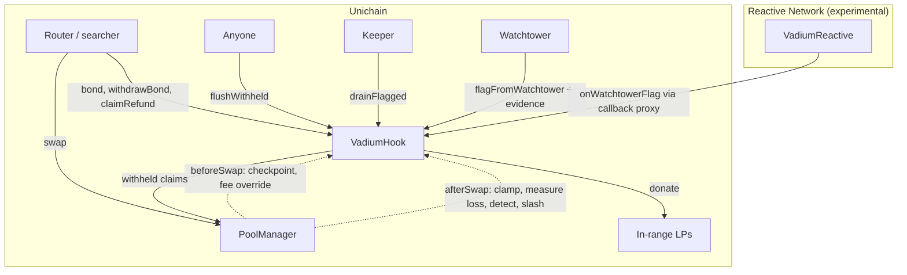

# Vadium

[](https://soliditylang.org)
[](https://book.getfoundry.sh)
[](LICENSE)
[](https://github.com/Majormaxx/vadium/actions)
[](https://www.unichain.org)

Accountable arbitrage for Uniswap v4 pools. Unbonded flow is held to the block-start price, so a sandwich cannot capture its victim's price impact. Bonded flow trades at the real price because it is slashable: a bonded address that completes a sandwich loses part of its bond, the victim is refunded first, and the pool's LP reserve takes the rest.

Testnet only. Unaudited. Read [the threat model](docs/THREAT-MODEL.md) before the code.

## Problem

A sandwich attacker sees your swap, trades ahead of it to move the price, lets you execute at the worse price, then trades back. Holding every swap in a block to the block-start price stops that cold, and OpenZeppelin ships an audited hook that does exactly this. The cost is that nobody can arbitrage the pool inside a block either, so the block-start price drifts from the market and honest flow pays the difference. The alternative, an auction for the right to trade first, needs an off-chain node.

## Mechanism

Two rules, one bond.

**Clamp.** At the first swap of each block the hook snapshots the pool's price and in-range liquidity. Every later swap in that block is compared with what it would have moved at the snapshot. A clamped swap that did better than the snapshot has the difference withheld as ERC-6909 claims the hook owns; anyone can flush those to the pool's LPs. A clamped swap that did worse simply did worse, and the shortfall is recorded as its loss. Both directions are clamped, so a back-run gains nothing from the victim's impact whether or not it shares an address with the front-run.

**Exemption.** An address with a live bond, no ban, and no active flag is exempt from the clamp on its first swap of each block. It trades at the real price. That exemption is what makes the pool's block-start price track the market: bonded arbitrageurs move it, everyone else follows one block later.

**Slash.** If a bonded address swaps, a different address swaps and gets a worse price than block start, and the bonded address then reverses direction in the same block, the detector fires. First strike takes half the bond; a repeat inside the escalation window takes the rest and bans the address. The victim is credited the smaller of its measured loss and half the slash, claimable at any time; the remainder goes to the pool's insurance reserve. The address is flagged, which strips the exemption, so a struck searcher is clamped like everyone else.

The economics are proven on a real PoolManager in [`test/Economics.t.sol`](test/Economics.t.sol): an unbonded sandwich, including one split across two addresses, cannot profit; a bonded sandwich has its second leg clamped and its bond slashed; a bonded market maker reversing around a trade that was not hurt is not slashed.

## Architecture


```mermaid
flowchart TB
    subgraph Pool["Unichain"]
        R[Router / searcher] -->|bond, withdrawBond, claimRefund| H[VadiumHook]
        R -->|swap| PM[PoolManager]
        PM -.->|beforeSwap: checkpoint, fee override| H
        PM -.->|afterSwap: clamp, measure loss, detect, slash| H
        H -->|withheld claims| PM
        A[Anyone] -->|flushWithheld| H -->|donate| LP[In-range LPs]
        K[Keeper] -->|drainFlagged| H
        W[Watchtower] -->|flagFromWatchtower + evidence| H
    end
    subgraph Reactive["Reactive Network (experimental)"]
        RSC[VadiumReactive] -->|onWatchtowerFlag via callback proxy| H
    end
```

The hook is a composition of three bases. Each implements no `IHooks` function, so other hook authors can inherit them.

| Base | Owns |
|---|---|
| [`BondedFlow`](src/base/BondedFlow.sol) | Bonds, strikes, bans, flags, evidence, per-pool registry and config, insurance reserves, victim refunds, roles, pause, sweeps |
| [`BlockPriceClamp`](src/base/BlockPriceClamp.sol) | Per-pool checkpoint, clamp target, withholding as claims, flush to LPs |
| [`ReactiveFlagReceiver`](src/base/ReactiveFlagReceiver.sol) | Cross-chain flag delivery and Reactive fee plumbing |

[`ExampleBondedHook`](src/examples/ExampleBondedHook.sol) is the smallest composition: a dynamic-fee pool where exempt addresses pay 5 bps less and a same-block reversal is slashed into the reserve. It is compiled and tested.

## Pools and identity

One hook instance serves many pools. The owner pre-registers a pool with its configuration; `beforeInitialize` reverts for anything else. Every registered pool must contain the hook's bond token, because reserve payouts are a one-sided donate of that token. Bonds, strikes, bans, flags, and refund credits are hook-wide; reserves, configuration, checkpoints, and the same-block ordering state are per pool.

The address the hook sees is the router, not the wallet behind it. A router that wants its user to receive a refund passes exactly 32 bytes of `hookData` holding that address. The exemption never reads `hookData`, so a router cannot borrow a bonded principal's privilege; it can only redirect its own user's refund. Professional searchers run their own router per strategy and bond on that router.

## Contract reference

Permissions: `beforeInitialize`, `beforeSwap`, `afterSwap`, `afterSwapReturnDelta`. The address is CREATE2-mined so its low 14 bits equal `0x20C4`; the constructor validates this.

### Bond parameters (hook-wide, owner-set within bounds)

| Parameter | Unichain default | Meaning |
|---|---|---|
| `minBond` | 100 USDC | Smallest bond accepted |
| `minBondDurationBlocks` | 7,200 (2 h) | Lock before an unstruck bond may withdraw |
| `firstSlashBps` | 5,000 | Share slashed on a first strike |
| `firstOffenseLockExtensionBlocks` | 86,400 (1 day) | Window in which another strike is a repeat; also the lock after a strike |
| `repeatOffenseBanBlocks` | 2,592,000 (30 days) | Re-bonding ban after a repeat |
| `victimRefundBps` | 5,000 | Ceiling on the share of a slash refunded to the victim |
| `refundClaimWindowBlocks` | 2,592,000 (30 days) | Time a victim has to claim before the owner may sweep the credit into a reserve |

Unichain produces one block per second; every count above is in blocks.

### Pool configuration (per pool, owner or operator)

| Field | Meaning |
|---|---|
| `clampEnabled` | Whether unbonded flow is clamped |
| `exemptFirstSwapOnly` | Whether a bonded address is exempt only on its first swap of a block |
| `requireVictimLoss` | Whether a slash needs the intervening swap to have executed worse than block start |
| `baseFee` | Fee for unbonded swappers on a dynamic-fee pool; must be 0 on a static-fee pool |
| `feeDiscountBps` | Discount for exempt swappers; dynamic-fee pools only |

v4 only honors a `beforeSwap` fee override on dynamic-fee pools, so a fee discount requires a dynamic-fee pool, on which the hook overrides every swap: the base fee for everyone, the discounted fee for exempt senders. The reference pool is static-fee with no discount; the exemption is the privilege.

### Roles

| Role | Functions | Set by |
|---|---|---|
| Owner (two-step) | `registerPool`, `setPoolConfig`, `setPoolOperator`, `setBondParams`, `setWatchtower`, `setKeeper`, `setReactiveRvm`, `pause`, `unpause`, `claimCoverage`, `sweepUnclaimed`, `sweepToken`, `rescueNative` | Constructor, `transferOwnership` + `acceptOwnership` |
| Pool operator | `setPoolConfig` for its pool | Owner |
| Keeper | `drainFlagged(poolId, searchers, maxAmount)` | Owner, rotatable |
| Watchtower | `flagFromWatchtower(poolId, searcher, amount, banUntil, evidenceHash)` | Owner, rotatable |
| Reactive RVM | `onWatchtowerFlag` through the callback proxy; extend-only | Owner, rotatable |
| Anyone | `bond`, `withdrawBond`, `claimRefund`, `flushWithheld` | |

A pause blocks bonding, refund claims, flushes, and payouts, and strips every exemption. It never blocks `withdrawBond`. `sweepToken` refuses any bond-token amount that is owed to bonds, reserves, or refund credits.

### Events

| Event | Emitted when |
|---|---|
| `Checkpointed(poolId, blockNumber, sqrtPriceX96, liquidity)` | First swap of a block on a pool |
| `ClampWithheld(poolId, sender, currency, amount)` | A clamped swap's gain is withheld |
| `WithheldFlushed(poolId, amount0, amount1)` | Withheld claims donated to LPs |
| `Sandwiched(poolId, searcher, slashed, isRepeat, remaining, flaggedUntil, refunded)` | A bonded address is penalized |
| `VictimRefundCredited(poolId, victim, searcher, amount)` | A victim credit is recorded |
| `RefundClaimed(victim, amount)` | A credit is claimed |
| `Flagged(searcher, poolId, slashed, evidenceHash, flaggedUntil)` | Watchtower or relay flag |
| `CoverageClaimed(poolId, amount, remainingReserve)` | Reserve paid to LPs |
| `Bonded`, `BondWithdrawn`, `PoolRegistered`, `PoolConfigSet`, `PoolOperatorSet`, `BondParamsSet`, `WatchtowerSet`, `KeeperSet`, `ReactiveRvmSet`, `UnclaimedSwept`, `TokenSwept`, `NativeRescued` | Lifecycle and administration |

### Errors

All custom, declared in [`IBondedFlow`](src/interfaces/IBondedFlow.sol) and [`IBlockPriceClamp`](src/interfaces/IBlockPriceClamp.sol). The ones a caller will meet first: `PoolNotRegistered`, `BondTooSmall(amount, minimum)`, `BondAlreadyActive`, `BondNotMatured(current, maturity)`, `Banned(until)`, `NoBond`, `NothingToClaim`, `NotFlagged`, `NothingToFlush`, `NoLiquidityToReceive`, `Unauthorized`.

## Gas

Figures from [`.gas-snapshot`](.gas-snapshot) under the CI profile, measured as whole test functions on a real PoolManager (router and settlement included), so they are upper bounds on the hook's own cost. CI fails if any moves more than 2%.

| Scenario | Gas |
|---|---|
| Bond through a router | 125,980 |
| Unbonded swap, first in block (checkpoint + record) | 259,477 |
| Front-run, victim, back-run with slash and refund | 776,839 |
| Withdraw bond | 154,900 |
| Flush withheld claims to LPs | 552,748 |

Runtime bytecode is 20.5 kB.

## Deployments

| Chain | Contract | Address |
|---|---|---|
| Unichain Sepolia (1301) | `VadiumHook` (earlier interface) | `0x6d6201097d6549F9760d61019E69E599315dc0C0` |
| Unichain Sepolia (1301) | ETH/USDC pool, 30 bps, spacing 10 | `0x8e04e9c3fd9137cdc79ef352d1b1af9c5b3c5384cca2d8641c754bd6a2000304` |
| Unichain (130) | | not yet |

The record of each deploy lives in [`deployments/`](deployments/). The current Sepolia addresses run the hook as it was before the clamp and refund were added; the next broadcast replaces them.

## Run it

```
git clone --recurse-submodules https://github.com/Majormaxx/vadium
cd vadium && cp .env.example .env
make test            # every suite except fork; 218 tests
make test-fork       # fork suites against UNICHAIN_SEPOLIA_RPC
make test-invariant  # invariants with a fresh seed, deeper runs
make snapshot-check  # gas within 2% of .gas-snapshot
make lint            # fmt, slither, semgrep
```

Deploy to Sepolia, then wire the roles:

```
make deploy-sepolia
KEEPER=0x... WATCHTOWER=0x... make wire
LIQUIDITY_DELTA=1000000 make add-liquidity
```

The deploy script mines the CREATE2 salt, deploys, registers the ETH/USDC pool, initializes it, offers ownership to `OWNER` when set, and writes `deployments/<chainId>.json`. On mainnet it refuses to run unless `OWNER` is a contract (a Safe) and `INITIAL_SQRT_PRICE` is set. See `make help` for the rest.

## Tests

| Suite | Covers |
|---|---|
| [`test/VadiumHook.t.sol`](test/VadiumHook.t.sol) | Registry, parameters, roles, ownership, pause, bond lifecycle, exemption, detector, penalties, refunds, watchtower, relay, drains, sweeps, reentrancy |
| [`test/Integration.t.sol`](test/Integration.t.sol) | Real PoolManager: sandwich, refund claim, attribution, drain through unlock and donate, second pool, flush, dynamic fees, checkpoints |
| [`test/Economics.t.sol`](test/Economics.t.sol) | Profit of unbonded, mule, and bonded sandwiches; victim loss; market-maker false positive; exact output; partial fills; the known bonded-mule hole |
| [`test/invariant/`](test/invariant/) | Solvency, reserve accounting, exemption conditions, claim backing, strike monotonicity |
| [`test/libraries/`](test/libraries/) | Pure math, fuzzed |
| [`test/React.t.sol`](test/React.t.sol) | Reactive relay end to end on the simulator |
| [`test/ExampleBondedHook.t.sol`](test/ExampleBondedHook.t.sol) | The module composes without the reference hook |
| [`test/fork/`](test/fork/) | Deployed pool state and liquidity on Unichain Sepolia |

## Known limits

Stated in full in [the threat model](docs/THREAT-MODEL.md).

- Two bonded addresses can split a sandwich's legs. Neither reverses, both are exempt on their first swap, nothing is slashed. The evidence-based watchtower exists for this. `test_KNOWN_bondedMuleHole` keeps the claim honest.
- The clamp target assumes block-start liquidity across the whole fill. Exact for full-range liquidity, approximate for concentrated liquidity outside the band.
- A refund goes to whoever the victim's router named, or to the router itself.
- The keeper decides when to drain a reserve and the in-range LPs at that moment receive it.

## Reactive relay

[`VadiumReactive`](src/reactive/VadiumReactive.sol) watches `Sandwiched` on the origin chain and relays a flag back through the Reactive callback proxy. The hook already flags on every slash, so for a same-hook sandwich the relay adds nothing; it exists for observers that correlate across accounts, blocks, or chains. It is experimental: the hook must hold native balance for the callback proxy's fees, which it accepts via `receive` and pays via `pay`.

## License

MIT.
